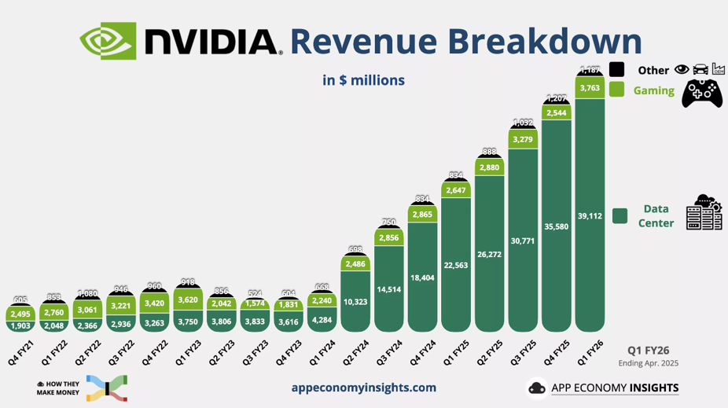
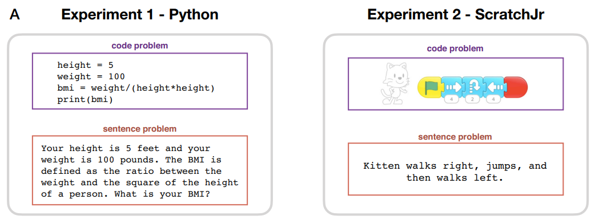
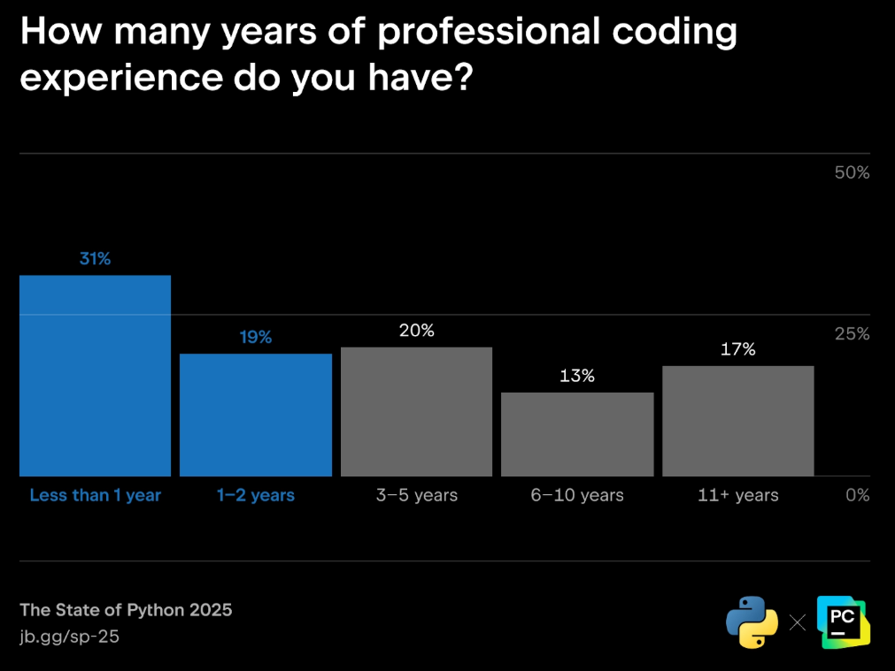

# Comment enseigner le Python à l'ère de l'intelligence artificielle générative ?

## [Pierre-Loïc Bayart](https://www.linkedin.com/in/pierreloicbayart/)

### Ingénieur de recherche pédagogique en intelligence artificielle

### [Multidisciplinary Institute in Artificial Intelligence - MIAI Cluster - Grenoble](https://miai-cluster.univ-grenoble-alpes.fr/)


---

## Comment enseigner le Python à l'ère de l'intelligence artificielle générative ?


---

## Comment enseigner le Python à l'ère de l'intelligence artificielle générative ?

## 🔄 Pourquoi apprendre le Python à l'ère de l'intelligence artificielle générative ?


---

## Comment enseigner le Python à l'ère de l'intelligence artificielle générative ?

## 🔄 Pourquoi apprendre le Python à l'ère de l'intelligence artificielle générative ?

## 🔝 Pourquoi apprendre à l'ère de l'intelligence artificielle générative ?

---

## Pourquoi apprendre à l'ère de l'intelligence artificielle générative ?

Différence entre savoir et connaissance
Différence avec le savoir de la machine, pas contextualisé et ni incarnée et celui de l'humain


---

## Pourquoi apprendre le Python à l'ère de l'intelligence artificielle générative ?

> "Nous devons arrêter de dire aux enfants qu'ils doivent apprendre à coder [...] aujourd'hui, tout le monde est un programmeur. C'est le miracle de l'IA", Jensen Huang, PDG de Nvidia, [World Government Summit Dubaï](https://www.youtube.com/watch?v=Y1pHXV7E4xY), 12/02/2024



*<sub>Source : [Nvidia reaches historic 92% GPU market share, leaves AMD and Intel far behind](https://www.techspot.com/news/108225-nvidia-reaches-historic-92-gpu-market-share-leaves.html), Techspot, 07/06/2025</sub>*

---

## Pourquoi apprendre le Python à l'ère de l'intelligence artificielle générative ?

Prompt = code en plus haut niveau ??
Mais **pas les mêmes régions du cerveau** qui sont utilisées



*<sub>Source : [Comprehension of computer code relies primarily on domain-general executive brain regions](https://pmc.ncbi.nlm.nih.gov/articles/PMC7738192/pdf/elife-58906.pdf), Ivanova et al., 15/12/2020</sub>*

---

## Pourquoi apprendre le Python à l'ère de l'intelligence artificielle générative ?

Prompt = code en plus haut niveau ??

Mais perte des communs, de la communauté

Meetup Python, PyconFr, EuroPython...


---

## Pourquoi apprendre le Python à l'ère de l'intelligence artificielle générative ?

**Plus de la moitié** des personnes qui font du Python l'ont appris **à l'ère de l'IA générative** (post novembre 2022)



*<sub>Source : [The State of Python 2025](https://blog.jetbrains.com/pycharm/2025/08/the-state-of-python-2025/), Jetbrains</sub>*

---
## Pourquoi apprendre le Python à l'ère de l'intelligence artificielle générative ?

Bien intégrer les **nouveaux arrivants** dans l'écosytème Python avec l'IA générative

> "Si nous ne choisissons pas **délibérément d’accueillir** cette **nouvelle génération** qui apprend grâce à ces outils, elle passera à côté d’**enseignements essentiels** que beaucoup d’entre nous ont appris dans la **difficulté**. Ce serait une erreur de les considérer comme de **“faux” programmeurs**."

*<sub>Source : [Welcoming The Next Generation of Programmers](https://lucumr.pocoo.org/2025/7/20/the-next-generation/), Armin Ronacher, créateur de Flask, 20/07/2025</sub>*

---

# Comment enseigner le Python à l'ère de l'intelligence artificielle générative ?

Constat : l'IA générative est très efficace pour resoudre les exercices de code de débutant en Python

---

# Comment enseigner le Python à l'ère de l'intelligence artificielle générative ?

## Dépend du public de la formation : enseignement secondaire, enseignement supérieur ou formation professionelle

## Dépend de l'objectif de la formation : apprendre les bases, être opérationnel dans la vie professionelle


---

# 🤖 **Nouveaux enjeux à l’ère de l’IA**

- Code généré ≠ code compris  
- Développer **esprit critique et lecture de code**
- La lecture et la compréhension du code a toujours eu une place importante mais elles le sont encore plus avec l'IA générative 

---

# 💻 **Exemple de prompt**

> Génère un exemple de code Python court (10 à 15 lignes) destiné à des étudiants débutants.
Contraintes :
>Le code doit avoir un objectif simple
>Il doit être suffisamment lisible pour que l’on puisse l’expliquer "ligne par ligne" à l’oral
>Il doit contenir une seule erreur qui empêche l’exécution
>L’erreur doit être subtile mais compréhensible pour un débutant
>N'ajoute aucun commentaire ni explication
---

# 💻 **Code généré**

```python
nombres = [2, 5, 8, 3, 10]
plus_grand = nombres[0]

for i in range(1, 6):
    if nombres[i] > plus_grand:
        plus_grand = nombres[i]

print("Le plus grand nombre est :", plus_grand)
```

Source : ChatGPT 5, le 25/10/25

---

## Comment enseigner le Python à l'ère de l'intelligence artificielle générative ?

- Outils pour l'enseignant / formateur

- Outils pour l'élève

- But de la formation : apprendre les bases, être opérationnel dans la vie professionelle

- Exemples : Chatbot MIT

- Force pour l'open source : Manim, GIF Matplotlib

---

## Conclusion

- Bien réfléchir à la manière d'intégrer les outils d'IA générative pour aider les enseignants et les élèves

- Besoin fort d'expliciter aux étudiants les outils d'IA générative utilisables dans l'apprentissage du Python

- Utilité de l'IA générative pour faciliter l'accès à des outils open-source dans l'enseignement

---

## 📚 Bibliographie : pourquoi apprendre à l'ère de l'intelligence artificielle générative ?

- [Intelligence artificielle. Le jour où nous n’aurons plus besoin d’apprendre](https://www.courrierinternational.com/long-format/ia-le-jour-ou-nous-n-aurons-plus-besoin-d-apprendre_234267), Courrier International, N°1819, 11/09/25 - 17/09/25

- [A quoi bon apprendre ?](https://le1hebdo.fr/journal/numeros/558/a-quoi-bon-apprendre/socit-ducation.html), Le Un Hebdo, N°558, 27/08/25 

- [A quoi bon encore apprendre ?](https://www.gallimard.fr/catalogue/a-quoi-bon-encore-apprendre/9782073137968), Camille Dejardin, Tracts Gallimard, Août 2025

- [Épisode 3/3 : IA : pourquoi jouer encore aux échecs alors qu’on ne peut pas gagner ?](https://www.radiofrance.fr/franceinter/podcasts/le-code-a-change/les-echecs-3-1306912), Podcast Le code a changé, France Inter, 30/09/25

---

## 📚 Bibliographie : pourquoi apprendre le Python à l'ère de l'intelligence artificielle générative ?

-

---

## 📚 Bibliographie : comment enseigner le Python à l'ère de l'intelligence artificielle générative ?

-