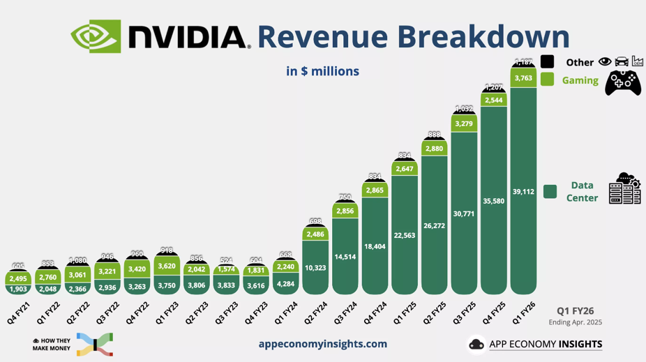
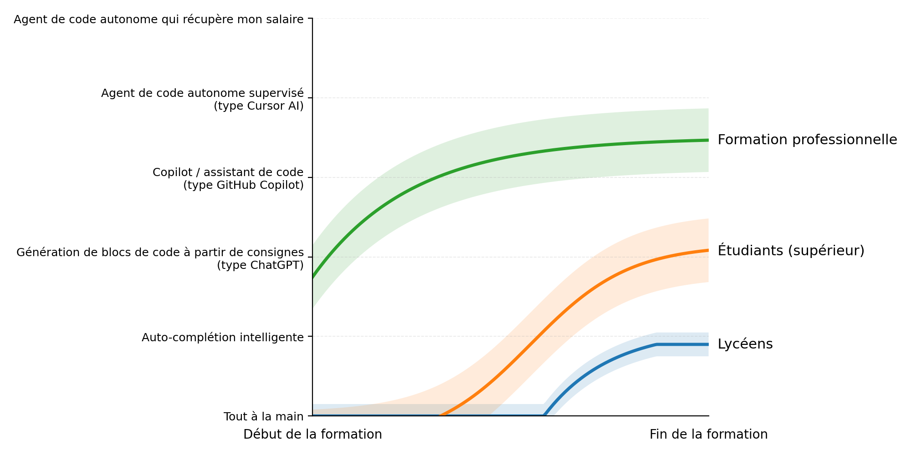
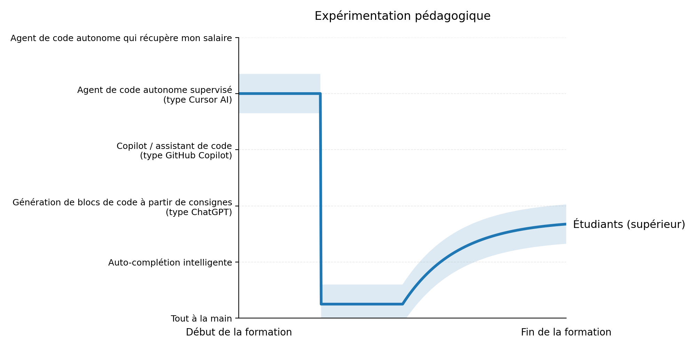
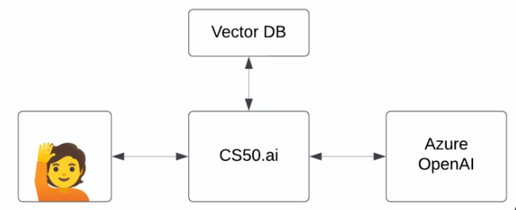

# Comment enseigner le Python à l'ère de l'intelligence artificielle générative ?

## [Pierre-Loïc Bayart](https://www.linkedin.com/in/pierreloicbayart/)

### Ingénieur de recherche pédagogique en intelligence artificielle

### [Multidisciplinary Institute in Artificial Intelligence - MIAI Cluster - Grenoble](https://miai-cluster.univ-grenoble-alpes.fr/)


---
# Mes biais de compréhension de l'IA

- Diplôme d’**ingénieur en génie énergétique et nucléaire**

- **7 ans d’expérience** en tant qu’ingénieur dans l’industrie électronucléaire (sites et centres d’ingénierie)

- **6 ans d’activité** comme **formateur** indépendant en **données et intelligence artificielle**

- **2 ans d’expérience** comme **ingénieur de recherche pédagogique en IA**
  
---

## Comment enseigner le Python à l'ère de l'intelligence artificielle générative ?


---

## Comment enseigner le Python à l'ère de l'intelligence artificielle générative ?

## 🔄 Pourquoi apprendre le Python à l'ère de l'intelligence artificielle générative ?


---

## Comment enseigner le Python à l'ère de l'intelligence artificielle générative ?

## 🔄 Pourquoi apprendre le Python à l'ère de l'intelligence artificielle générative ?

## 🔠Pourquoi apprendre à l'ère de l'intelligence artificielle générative ?

---

## Pourquoi apprendre à l'ère de l'intelligence artificielle générative ?

Différence entre **savoir** de la machine, ni contextualisé ni incarné et **connaissance** humaine


---

# 🤔📚ğŸğŸ¤–
# Pourquoi apprendre le Python à l'ère de l'intelligence artificielle générative ?

---

## Pourquoi apprendre 📚 le Python ğŸ à l'ère de l'intelligence artificielle générative ?

> "Nous devons arrêter de dire aux enfants qu'ils doivent apprendre à coder [...] aujourd'hui, tout le monde est un programmeur. C'est le miracle de l'IA", Jensen Huang, PDG de Nvidia, [World Government Summit Dubaï](https://www.youtube.com/watch?v=Y1pHXV7E4xY), 12/02/2024



*<sub>Source : [Nvidia reaches historic 92% GPU market share, leaves AMD and Intel far behind](https://www.techspot.com/news/108225-nvidia-reaches-historic-92-gpu-market-share-leaves.html), Techspot, 07/06/2025</sub>*

---

## Pourquoi apprendre 📚 le Python ğŸ à l'ère de l'intelligence artificielle générative ?

Prompt = code en plus haut niveau ??
Mais **pas les mêmes régions du cerveau** qui sont utilisées


*<sub>Source : [Comprehension of computer code relies primarily on domain-general executive brain regions](https://pmc.ncbi.nlm.nih.gov/articles/PMC7738192/pdf/elife-58906.pdf), Ivanova et al., 15/12/2020</sub>*

---

## Pourquoi apprendre 📚 le Python ğŸ à l'ère de l'intelligence artificielle générative ?

Prompt = code en plus haut niveau ??

Mais **perte des communs**, de la **communauté**

Meetup Python, PyconFr, EuroPython...

<a href="https://meetup-python-grenoble.github.io/"></a>

---

## Pourquoi apprendre 📚 le Python ğŸ à l'ère de l'intelligence artificielle générative ?

**Plus de la moitié** des personnes qui font du Python l'ont appris **à l'ère de l'IA générative** (post novembre 2022)


*<sub>Source : [The State of Python 2025](https://blog.jetbrains.com/pycharm/2025/08/the-state-of-python-2025/), Jetbrains</sub>*

---
## Pourquoi apprendre 📚 le Python ğŸ à l'ère de l'intelligence artificielle générative ?

Bien intégrer les **nouveaux arrivants** dans l'écosystème Python à l’ère de l’IA générative

> "Si nous ne choisissons pas **délibérément d’accueillir** cette **nouvelle génération** qui apprend grâce à ces outils, elle passera à côté d’**enseignements essentiels** que beaucoup d’entre nous ont appris dans la **difficulté**. Ce serait une erreur de les considérer comme de **“faux†programmeurs**."

*<sub>Source : [Welcoming The Next Generation of Programmers](https://lucumr.pocoo.org/2025/7/20/the-next-generation/), Armin Ronacher, créateur de Flask, 20/07/2025</sub>*

---

# 🛠ï¸ğŸ‘©â€ğŸ«ğŸğŸ¤–
# Comment enseigner le Python à l'ère de l'intelligence artificielle générative ?

---

# Comment enseigner 👩â€ğŸ« le Python ğŸ à l'ère de l'intelligence artificielle générative ?

Constat : l'IA générative est **très performante** pour **résoudre les exercices de code de débutant** en Python

D'où l'intérêt d'expliquer l'**importance de ces exercices** et les bons usages possibles de l'IA générative

---

# Comment enseigner 👩â€ğŸ« le Python ğŸ à l'ère de l'intelligence artificielle générative ?

**Cela dépend du public de la formation :** enseignement secondaire, enseignement supérieur ou formation professionnelle...

**Cela dépend aussi de l’objectif :** apprendre les bases, être opérationnel dans la vie professionnelle...

**Outils différents** pour les **enseignants** et les **élèves**

---

# Comment enseigner 👩â€ğŸ« le Python ğŸ à l'ère de l'intelligence artificielle générative ?



---
# Comment enseigner 👩â€ğŸ« le Python ğŸ à l'ère de l'intelligence artificielle générative ?



---
# 🤖 **Nouveaux enjeux à l’ère de l’IA**

- **Code généré ≠ code compris**
- Déplacement du travail vers la **vérification** (comme pour les traducteurs)
- Développer **esprit critique et lecture de code**
- La **lecture** et la **compréhension** du code a toujours eu une **place importante** mais elles le sont encore plus avec l'IA générative 

---

# 💻 **Exemple de prompt**

> Génère un exemple de code Python court (10 à 15 lignes) destiné à des étudiants débutants.
Contraintes :
>Le code doit avoir un objectif simple
>Il doit être suffisamment lisible pour que l’on puisse l’expliquer "ligne par ligne" à l’oral
>Il doit contenir une seule erreur qui empêche l’exécution
>L’erreur doit être subtile mais compréhensible pour un débutant
>N'ajoute aucun commentaire ni explication
---

# 💻 **Code généré**

```python
nombres = [2, 5, 8, 3, 10]
plus_grand = nombres[0]

for i in range(1, 6):
    if nombres[i] > plus_grand:
        plus_grand = nombres[i]

print("Le plus grand nombre est :", plus_grand)
```

Source : ChatGPT 5, le 25/10/25

---

## Comment enseigner 👩â€ğŸ« le Python ğŸ à l'ère de l'intelligence artificielle générative ?

L’IA générative aide aussi à **créer rapidement** des supports pédagogiques interactifs : [Manim](https://www.manim.community/) ([3Blue1Brown](https://www.youtube.com/channel/UCYO_jab_esuFRV4b17AJtAw)), GIF Matplotlib, [Jupyter Lite](https://jupyterlite.readthedocs.io/en/stable/) sur Gitlab...


---

## Comment enseigner 👩â€ğŸ« le Python ğŸ à l'ère de l'intelligence artificielle générative ?

[Chatbot dans cours CS50 Harvard](https://www.youtube.com/watch?v=6rAWxGAG6EI) avec des garde-fous pédagogiques



---

## Conclusion

- Bien réfléchir à la **manière d'intégrer les outils d'IA générative** pour aider les enseignants et les élèves

- Besoin fort d'**expliciter aux étudiants les outils d'IA générative utilisables** dans l'apprentissage du Python

- Utilité de l'IA générative pour **faciliter l'accès à des outils open-source Python** dans l'enseignement
---

## 📚 Bibliographie : pourquoi apprendre à l'ère de l'intelligence artificielle générative ?

- [Intelligence artificielle. Le jour où nous n’aurons plus besoin d’apprendre](https://www.courrierinternational.com/long-format/ia-le-jour-ou-nous-n-aurons-plus-besoin-d-apprendre), Courrier International, N°1819, 11/09/25 - 17/09/25

- [A quoi bon apprendre ?](https://le1hebdo.fr/journal/numeros/558/a-quoi-bon-apprendre/socit-ducation.html), Le Un Hebdo, N°558, 27/08/25 

- [A quoi bon encore apprendre ?](https://www.gallimard.fr/catalogue/a-quoi-bon-encore-apprendre/9782073137968), Camille Dejardin, Tracts Gallimard, Août 2025


---

## 📚 Bibliographie : pourquoi apprendre le Python à l'ère de l'intelligence artificielle générative ?

- [Keynote: "Python: the Documentary" Q&A — Paul Everitt, Armin Ronacher, Brett Cannon](https://www.youtube.com/watch?v=Sf2AqQ5a38Y), EuroPython 2025

---

## 📚 Bibliographie : comment enseigner le Python à l'ère de l'intelligence artificielle générative ?

- [Chaîne Youtube 3Blue1Brown](https://www.youtube.com/channel/UCYO_jab_esuFRV4b17AJtAw), Grant Sanderson


- [Teaching CS50 with AI](https://www.youtube.com/watch?v=6rAWxGAG6EI), 2025

- [Improving AI in CS50](https://cs.harvard.edu/malan/publications/fp0627-liu.pdf), Harvard, 2025

---

# Merci de votre attention

